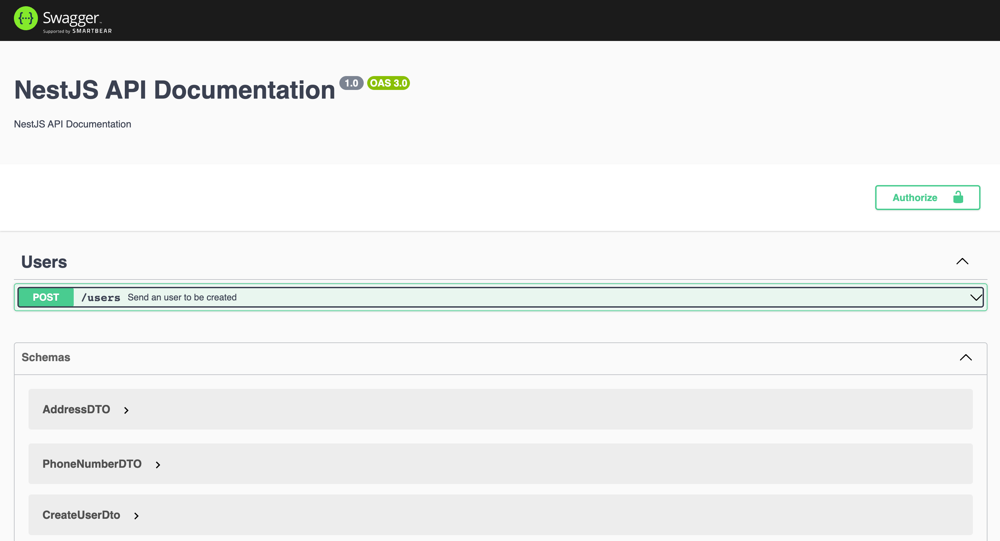
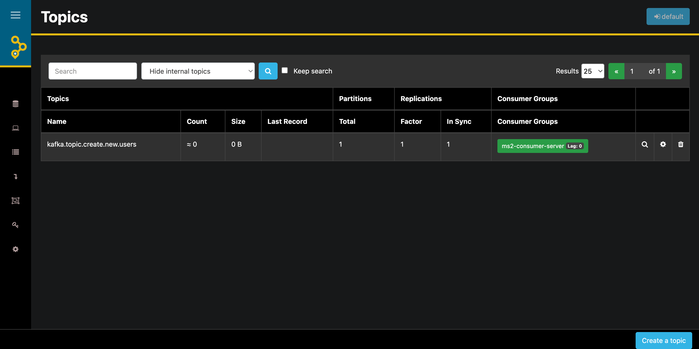

# Desafio App Trade

## 💻 Pré-requisitos

Antes de começar, verifique se você atende aos seguintes requisitos:

Você instalou o Docker e o docker-compose em sua máquina. Caso ainda não tenha instalado, você pode encontrar as instruções de instalação nos seguintes links:

- [Docker](https://docs.docker.com/get-docker/)
- [Docker Compose](https://docs.docker.com/compose/install/)

## 🚀 Instalação

Para instalar o projeto, siga estas etapas:

Clone o repositório do projeto para a sua máquina:
```
git clone https://github.com/DaywisonFerreira/desafio-ms.git
```

Navegue até o diretório do projeto:
```
cd desafio-ms
```

Execute o seguinte comando para iniciar o projeto usando o Docker Compose:
```
docker-compose up -d
```


## ☕ Uso

### Documentação API
Acesse o endpoint http://localhost:3000/api para interagir com a aplicação.




### Kafka UI
Você pode acessar o kafka UI nesse endpoint: http://localhost:8080


